- Prep
	- [[Learning outcomes]]
		- [previous work from the [[TtT]] couse](((65b8ff46-4a8a-4940-858a-6a6db2001a38)))
			- That was for a longer course, so I think I want to scale it back a little for this 90 minuter
				- I want to avoid the desire to "fill the time". Let's work backwards from the learning objectives
		- ==At the end of this 90 minute session, participants will be able to analyze their note-taking needs and create a note-taking plan.==
		  id:: 65b90087-f80a-489f-be1b-9fc9f9f47699
- Spiel:
  id:: 65e6f50a-885e-4e76-aa57-a05d27f6395e
	- Many of us want to be taking better notes, but devising our perfect note-taking system is a task that is easy to put off until the eternal tomorrow.
	- ((65b90087-f80a-489f-be1b-9fc9f9f47699))
	- Participants will learn how note-taking fits into the aims of the open research movement by allowing research to be more efficient, trustworthy, and collaborative.
	- In addition to these more theoretical considerations, I'll give practical demos of both general purpose note-taking software and more specialized lab notebook software (all open source).
	- The session will be primarily geared towards people who conduct research and work in teams, but anyone who takes notes (or would like to start taking notes) may find the course valuable.
- Intro
	- Slides available at: https://dannygarside.co.uk/open-notebook
	- Structure:
	  1. How and why we takes notes
	  2. How notetaking fits into open research goals
	  3. Demos of note-taking tools for research
	- Meta:
		- my role today is going to be somewhere between teacher and facilitator - I'm not going to be able to give you a magic notebook that solves all your problems, but I _can_:
			- help you think through what your needs are by suggesting useful prompts for reflection
			- try to convince you that this is something that is worth spending a little consideration on
			- show you some potentially useful tools to help you meet your needs
	- Tailoring today's session to the group: what are you excited about today, or hoping to get out of this session?
	- Questions welcome throughout
- Content
	- ## How and why we takes notes
		- Set the mood by showing that I've been "bad" at it previously
			- _I want to walk the line of destigmatising "bad" note taking, while also preserving the idea that I might have things of value to say on this subject_
			- For many years I used Muji B5 notebooks:
			  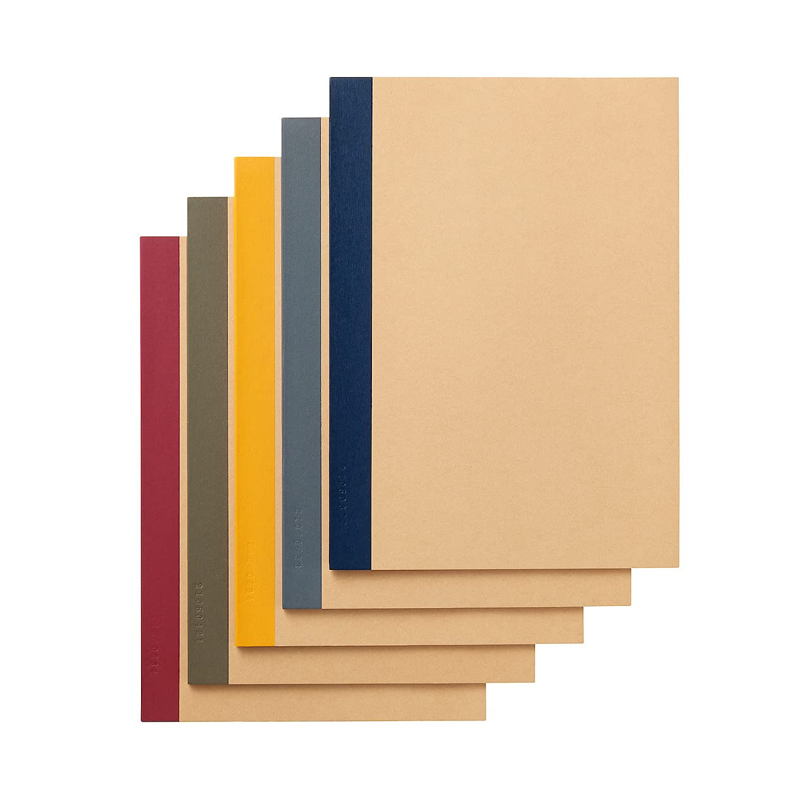{:height 293, :width 306} 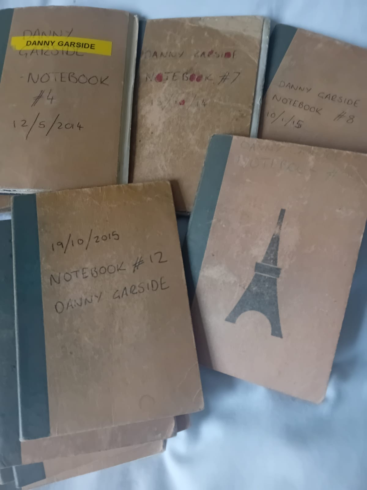{:height 419, :width 353}
			- My PhD notes:
			  * Scattered notes in Google Keep 
			  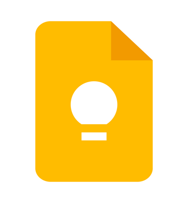{:height 225, :width 156} 
			  * A massive (200 page, 100MB) word document 
			  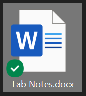{:height 225}
			- 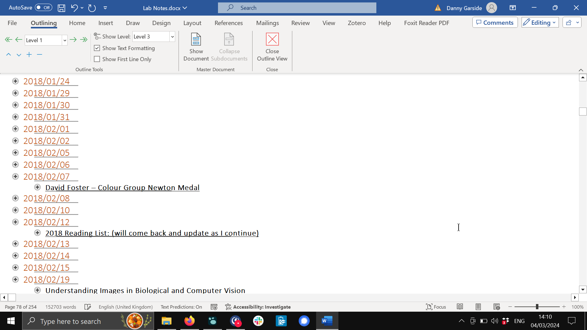
			- 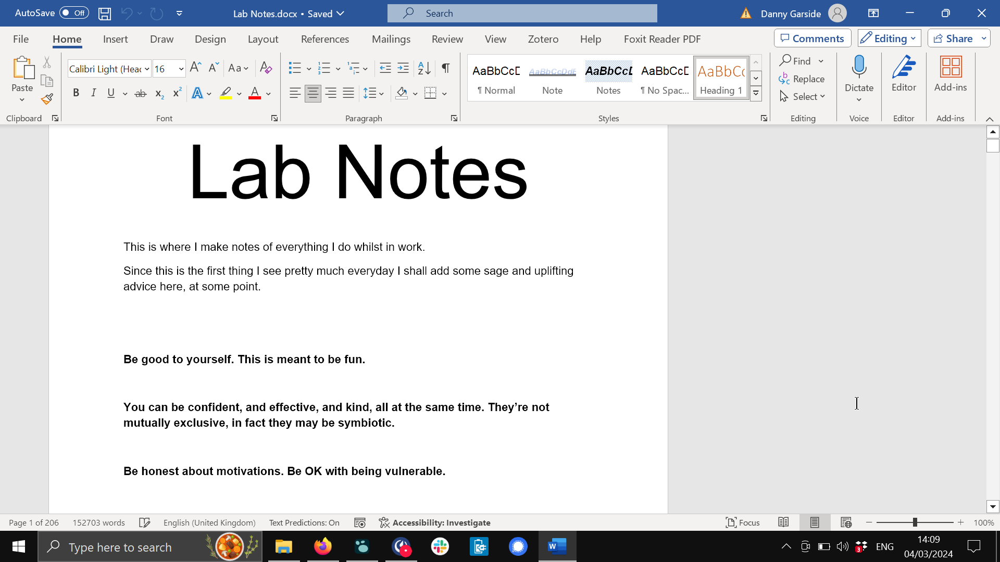
			- These options had issues, but were a super useful improvement over my prior practice.
			  
			  **"Don't let perfect be the enemy of good"**
		- **3 minute self-reflection: What have your note-taking systems been so far?**
		  
		  Both in terms of:
		  * **modality** - paper notebook, emailing yourself, napkins?
		  * **context/technique** - When do you take notes? What kind of notes?
		- _Why_ do we take notes?
			- Personally, I write down my logic when I'm thinking through theory so that I can come back to it later and ask:
			  * "how did I get to this conclusion?" 
			  * or "what was that other potential path of inquiry that I looked at but decided against? _Why_ did I decide against that?"
			- And for coding I write down "I tried X, and it didn't work because Y". 
			  And I do that _again_ and _again_ 😂😭
			- **Why else do people take notes?**
				- Why we take notes?
				  * To think
				  * To store
				  * To collaborate
				  * To share
		- **3 minute self-reflection: What would the you of 10 years into the future want?**
	- ==5 minute break==
	- ## How notetaking fits into [[open research]] goals
	  id:: 65e5f07b-0467-4871-9ca6-d86c8cd6a64a
		- [[Open research]] summary:
			- 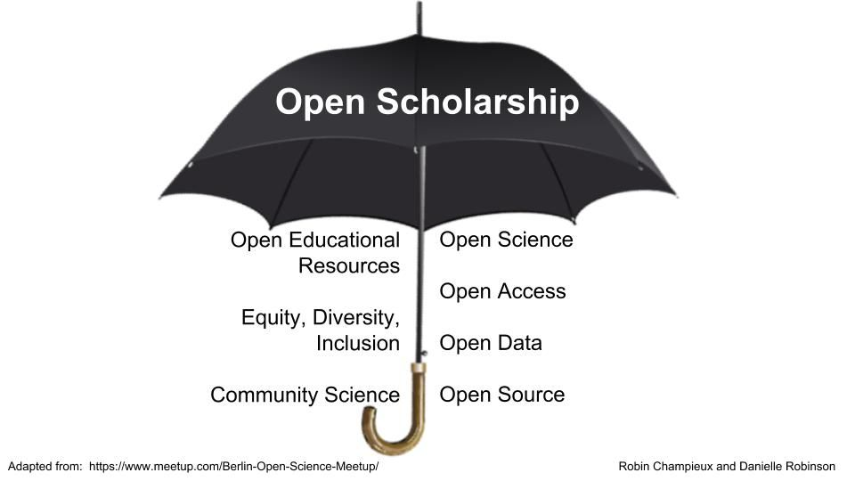
			  Source: https://osaos.codeforscience.org/what-is-open/
			- **What is "Open"?**
			  
			  "Transparent and freely available for use, reuse, remixing, and sharing."
			  
			  Open Source Alliance, Danielle Robinson - https://osaos.codeforscience.org/what-is-open/
				- "In our context, *open* often modifies another term such as open source or open access, implying a difference from a conventional, closed or non-transparent approach."
				- "We see open practices as a way to accelerate rate of discovery, drive quality of research, and remove barriers to participation in learning and discovery."
		- General ways in which good note taking aligns with this framework:
			- Making research more: 
			  * efficient
			  * trustworthy
			  * collaborative
			- #### Efficient
			  We cannot remember everything. Writing notes avoids us forgetting, and having to re-do work, or worse: guess at what happened or why we chose to do something.
			- #### Trustworthy
			  With good notes you can provide all the details when they're requested in the future. You can recount how you got from point a to point b.
			- #### Collaborative
			  Keeping notes for yourself makes it possible to share those notes with others (collaborators, reviewers, public?)
			- Being confident in your note-taking sets the stage for...
		- [[open notebooks]]!
			- "**Open-notebook science** is the practice of making the entire primary record of a research project publicly available online as it is recorded."
			  
			  _https://en.wikipedia.org/wiki/Open-notebook_science_
				- "This involves placing the personal, or laboratory, notebook of the researcher online along with all raw and processed data, and any associated material, as this material is generated."
				- "The approach may be summed up by the slogan 'no insider information'. It is the logical extreme of transparent approaches to research and explicitly includes the making available of failed, less significant, and otherwise unpublished experiments; so called 'dark data'."
			- This makes our work _even more_ **efficient**, **trustworthy**, and **collaborative**.
				- "We see open practices as a way to accelerate rate of discovery, drive quality of research, and remove barriers to participation in learning and discovery."
				  
				  Open Source Alliance, Danielle Robinson - https://osaos.codeforscience.org/what-is-open/
			- Arguments against open notebooks:
			  
			  * fear of being "scooped"
			  * is it a "prior publication"? (invalidates patents?)
			  * spoils independence of researchers
			  * adds to "data deluge"
			- Examples:
				- Platforms:
					- 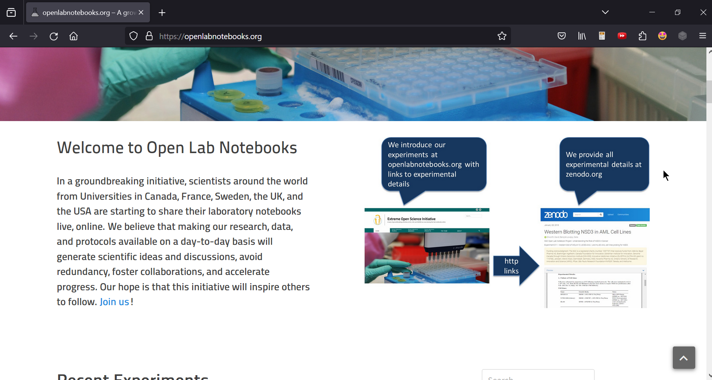
					  https://OpenLabNotebooks.org is a platform where people can keep an [[open lab notebook]]
				- Independent:
				  id:: 65e5f07b-55db-4712-8b7f-fc8e53f8c0c9
				  :LOGBOOK:
				  CLOCK: [2024-03-04 Mon 17:05:57]
				  :END:
					- Wikipedia list:
					  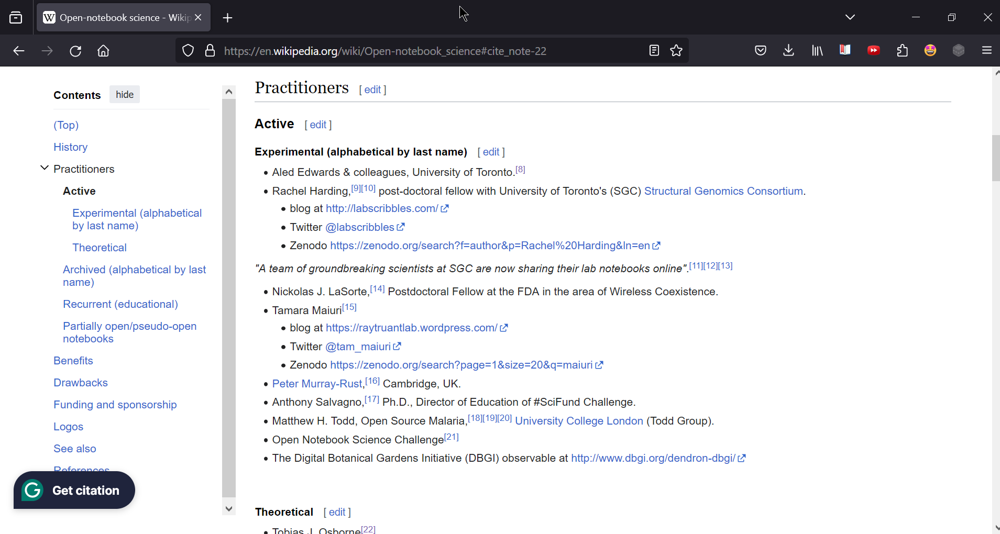
					  but... lots of [[link rot]] 😭
					- 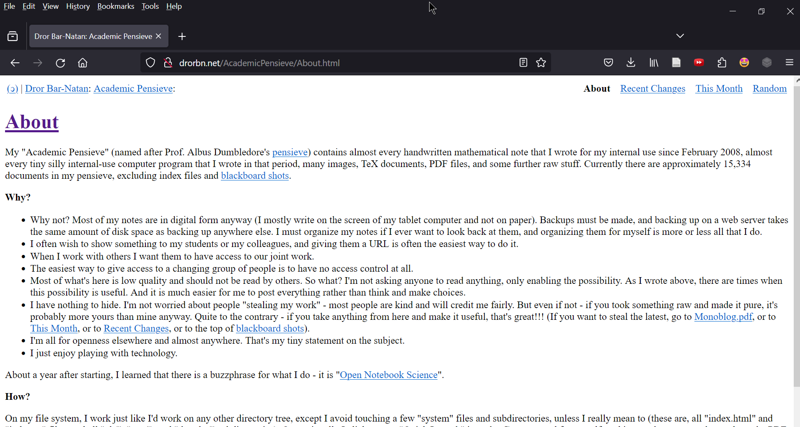
					  http://drorbn.net/AcademicPensieve/About.html
					- 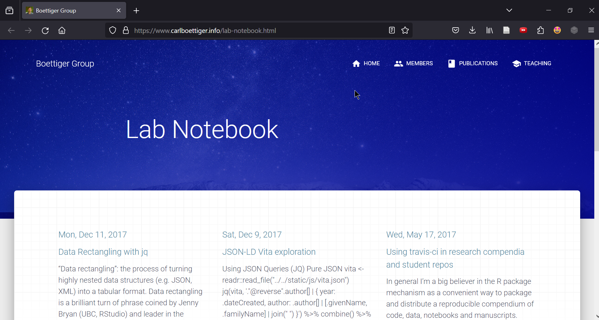 
					  https://www.carlboettiger.info/lab-notebook.html
					- 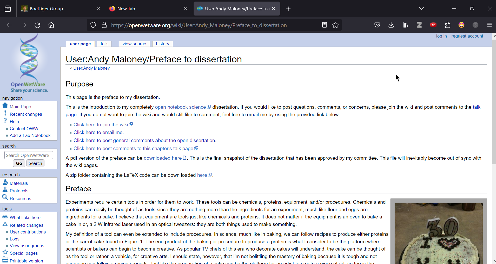
					  https://openwetware.org/wiki/User:Andy_Maloney/Preface_to_dissertation
					- #### _Related concept: [[digital garden]]_
					  "A digital garden is an online space at the intersection of a notebook and a blog, where digital gardeners share seeds of thoughts to be cultivated in public. Contrary to a blog, where articles and essays have a publication date and start decaying as soon as they are published, a digital garden is evergreen: digital gardeners keep on editing and refining their notes."
					  https://nesslabs.com/digital-garden-set-up
						- 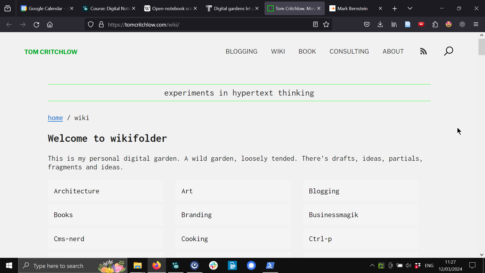
						  https://tomcritchlow.com/wiki/
						- 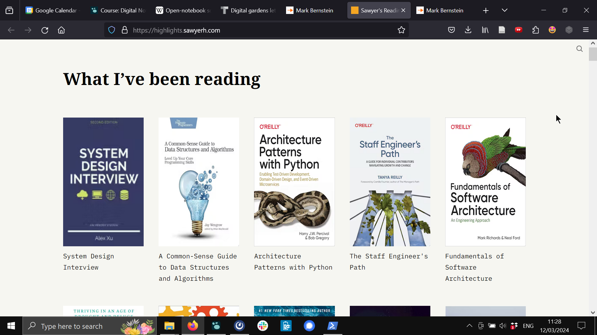
						  https://highlights.sawyerh.com/
						- 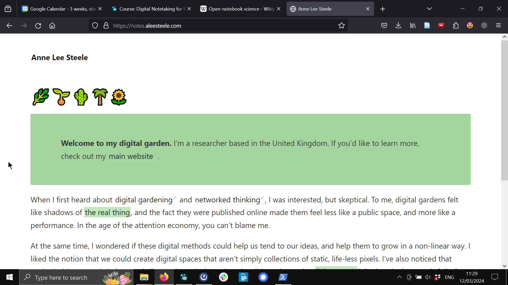
						  https://notes.aleesteele.com/
						- Playful, creative, adaptable
						  but... potentially fragile, difficult to find and interact with, requires tech skills
	- ==5 minute break==
	- ## Demos of note-taking tools for research
		- What attributes do we want in a note-taking tool?
		  * Depends on our needs!
		  * But...
		  * Open source is generally a good idea! (to avoid format lock-in or vendor lock-in)
		- General or specialised?
		  * _General tools_ are flexible
		  * _Specialised tools_ can offer a lot of built-in capabilities
			- Super flexible: a digital notepad
			  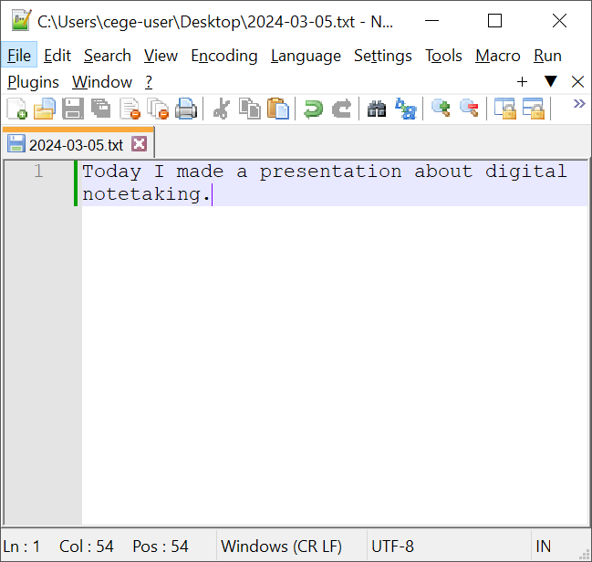{:height 343, :width 424}
			  * Build it yourself to precisely meet _your_ needs
			  * (`.txt` or `.md` recommeded over `.docx` etc)
			- [[Personal Knowledge Management]] tools / [[external brain]] tools (e.g. [[logseq]])
			  * These tools aim to store knowledge in an intuitive fashion such that it can be easily stored and recalled
			  * [Personal example](https://dannygarside.co.uk/open-notebook)
			  * [Collaborative example](https://www.dannygarside.co.uk/blog/An-open-source-knowledge-management-system-for-the-lab/)
			- Specialised lab notebooks:
				- [[OpenBIS]]: https://openbis.ch/wp-content/uploads/2018/08/intro-video-4.mp4
				- [[eLabFTW]]: {{video https://youtu.be/AkCMDoC3ZZc}}
	- ## Wrap up exercise
		- ==At the end of this 90 minute session, participants will be able to analyze their note-taking needs and create a note-taking plan.==
		- Think about a project that you're involved in, or that you might be involved in in the future
		  * What types of notes have that group made previously?
		  * Where could the group/project benefit from note-taking? (thinking? storing? collaborating? sharing?)
		  * What would it look like to be "as public as possible, as private as necessary?"
		  * How might you ensure robust long-term storage (avoid link rot)
		  * Would a generalist or specialised tool be most useful?
	- ## Further reading:
		- [[The Turing Way]] chapter on [[Electronic Lab Notebooks]] - https://the-turing-way.netlify.app/reproducible-research/rdm/rdm-elns.html
			- _[[The Turing Way]] is a collaboratively written set of guides for reproducible, ethical and collaborative data science._
		- "Open laboratory notebooks: good for science, good for society, good for scientists" - [https://doi.org/10.12688/f1000research.17710.2](https://doi.org/10.12688/f1000research.17710.2)
		- [[MIT Tech Review]] article on [[digital gardens]]: https://www.technologyreview.com/2020/09/03/1007716/digital-gardens-let-you-cultivate-your-own-little-bit-of-the-internet/
-